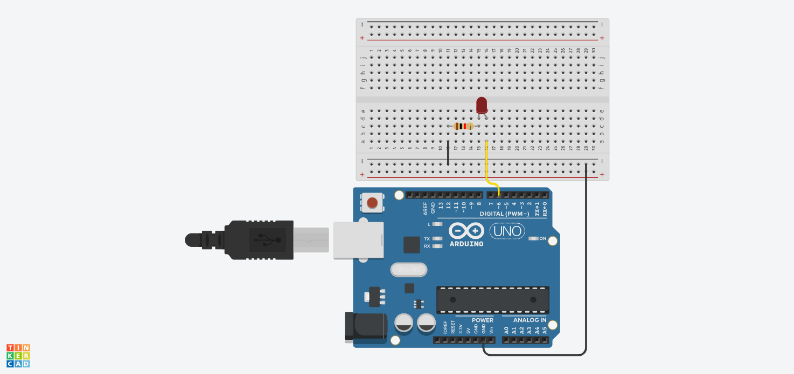
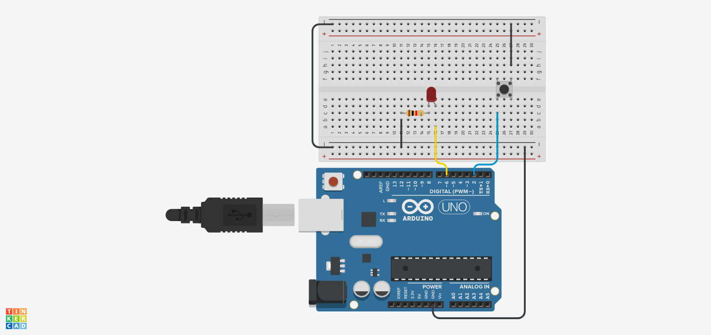
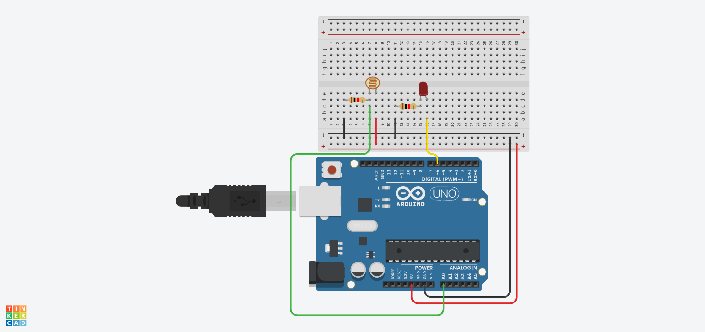

# f20-audiodesign

## Arduino

For at kunne programmere arduino skal I installere Arduino IDE'et herfra: [https://www.arduino.cc/en/Main/Software](https://www.arduino.cc/en/Main/Software).

### LED

###  Knap

### LDR

